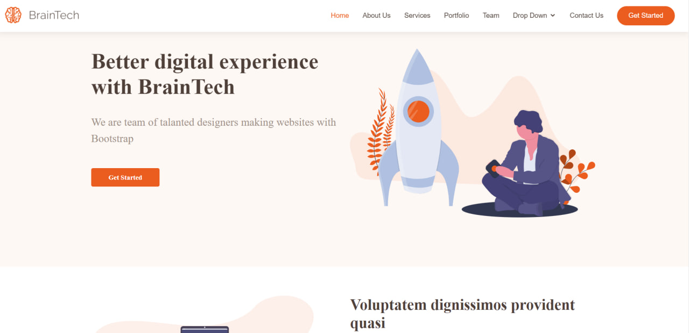

# BrainTech Bootstrap Template - Dynamic Web Presentation

Welcome to the BrainTech Bootstrap Template project! This is a sleek, modern web template designed for creating engaging digital experiences. It’s built using the latest web technologies and designed for tech startups, agencies, or personal portfolios.

## Features

- **Elegant Landing Page**: Features a hero section with a powerful call-to-action, making it perfect for product launches or service showcases.
- **About Section**: Introduce your mission, vision, and values with a compelling about section.
- **Service Offerings**: Detailed services section with modern icons and descriptions.
- **Interactive Portfolio**: Showcase your work with an interactive and filterable portfolio section.
- **Team Profiles**: Introduce your talented team members.
- **FAQs**: An FAQ section to address common questions and concerns.

## Technologies Used

- **HTML5**: The backbone of the webpage structure.
- **Bootstrap**: For responsive design and pre-styled components.
- **JavaScript**: To make the website dynamic and interactive.
- **jQuery**: For simplified HTML document traversing, event handling, and Ajax interactions.
- **AOS Library**: For scroll-based animations.

## Setup

Clone the repository:
[git clone https://github.com/Vergos1/project_OLD-Braintech.git](https://github.com/Vergos1/project_OLD-Braintech.git)

## Created by
Crafted with 💜 by [Ihor Yanchuk](https://github.com/Vergos1). For more information or to view my other work, please visit [my portfolio](http://yanchuk.vinnytsia.ua/).

